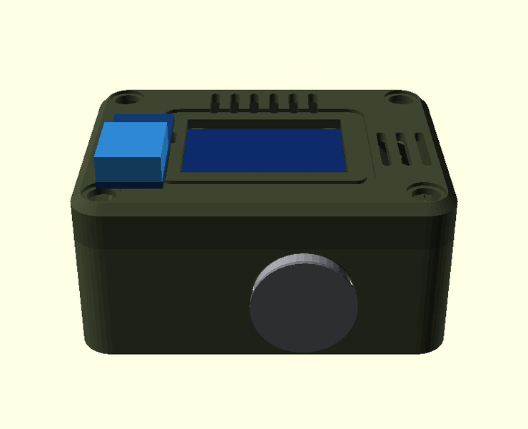
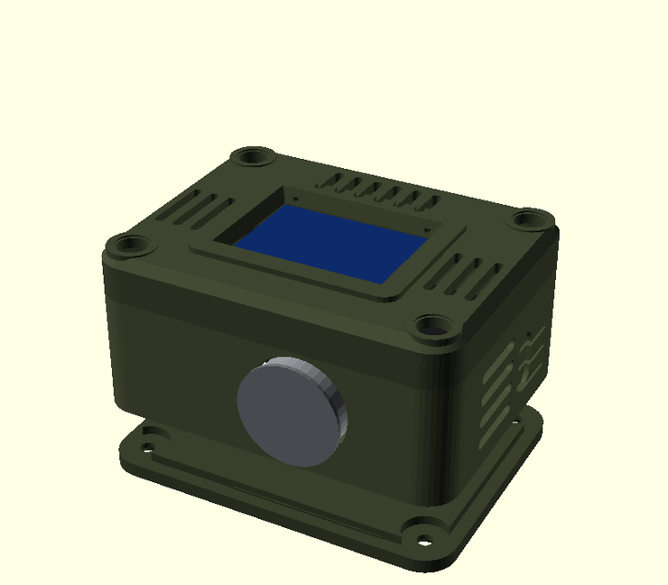
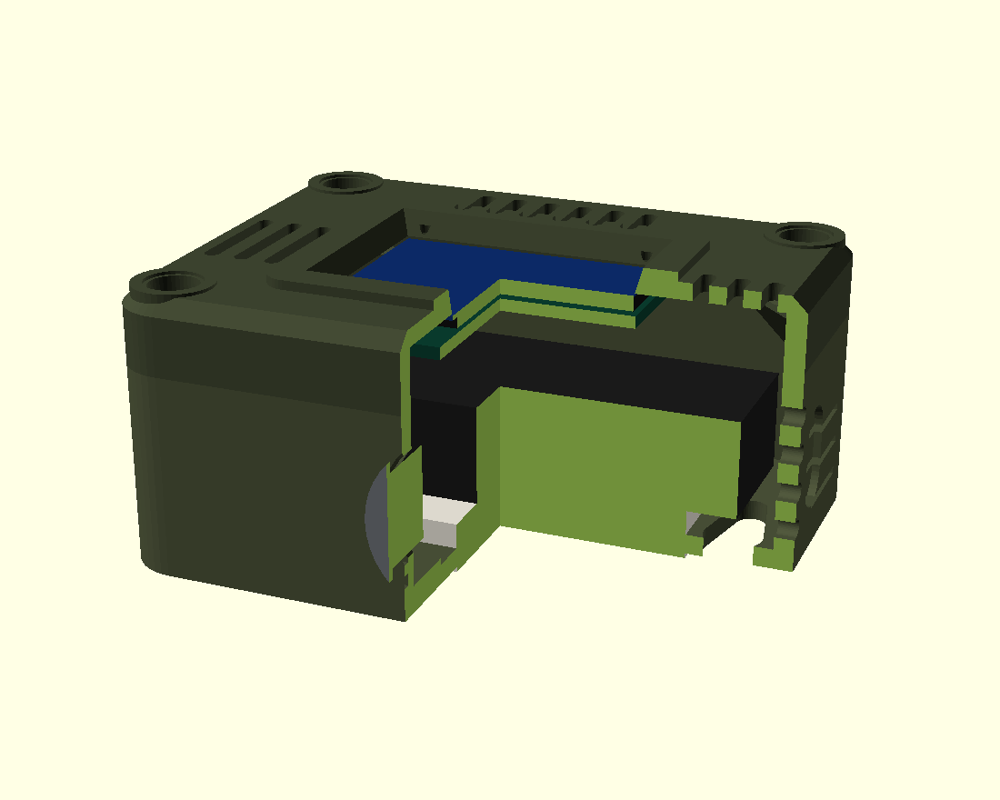
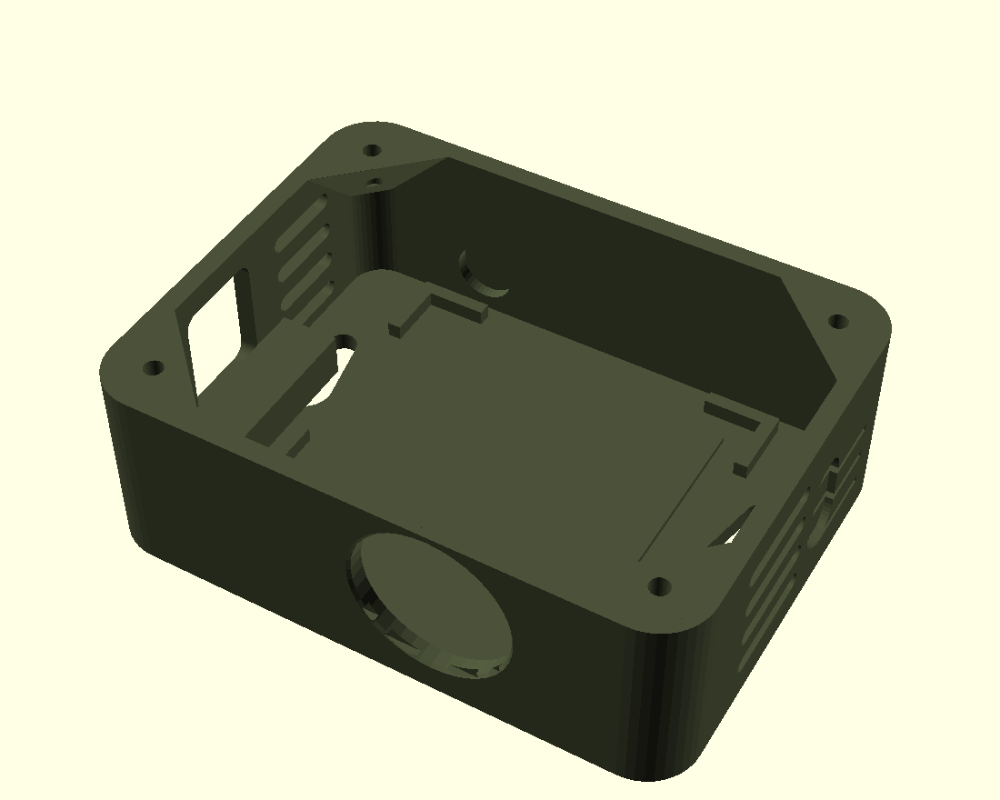
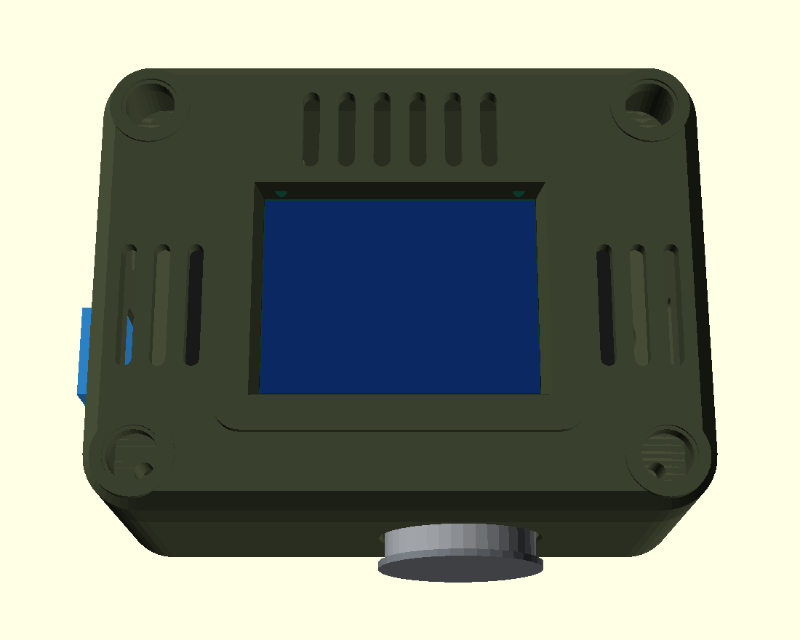

# OPS Sensor Unit

A rugged, field-style desk monitor for **air quality, temperature and humidity** — ESP32 + 1.3" OLED + MQ-135 + DHT11, in a 3D-printed enclosure designed around the actual parts rather than around a render.



**77.8 × 59.3 × 35.7 mm · two printed parts · ~44 g of filament · 1 h 23 m to print**

---

## What it measures — and what it doesn't

Being blunt about this up front, because most projects like this aren't:

| Claim | Reality |
|---|---|
| Temperature, humidity | ✅ DHT11 — ±2 °C, ±5 % RH. Coarse but honest. |
| "Air quality" | ⚠️ MQ-135 senses a **mixture of gases** (CO₂, VOCs, smoke, alcohol, NH₃) as a single resistance change. Useful as a *stale-air / smoke* indicator. |
| **AQI / PM2.5** | ❌ **Not possible with these parts.** An MQ-135 cannot see particulates. Anything labelling its output "AQI" is inventing a number. |

The firmware therefore reports an **AQ index** with a band (GOOD / FAIR / POOR / BAD), never a fake PM2.5 figure. If you want real PM2.5, add a PMS5003 or SDS011 — there is room in the case.

The MQ-135 also needs **24–48 h of burn-in** when new, and a few minutes of heater warm-up on every boot. The firmware shows a warm-up screen and refuses to present a reading as trustworthy before then.

---

## The enclosure

| | |
|---|---|
|  |  |
| Two-part shell: base tub + top cover, four M3 × 5 screws | Sectioned — the electronics are fully enclosed |
|  |  |
| Breadboard corner brackets, sensor supports, corner webs | Display window, vent fields, recessed screw pads |

**Design decisions worth knowing:**

- **Corner screw webs, not towers.** Each corner has a triangular gusset welded into the two walls — 13 mm legs tapering to 4 mm over 9 mm of height, a 45° self-supporting underside. 0.36 cm³ each instead of 1.56 cm³ as a column.
- **Sensors on perpendicular walls.** The MQ-135's heater runs hot enough to corrupt a nearby humidity reading, so the DHT11 sits on the left flank, 49 mm away, with its own vent field.
- **Breadboard is captive.** Four L-brackets hug the board's footprint with 0.3 mm clearance, on a raised pad.
- **Nothing needs support.** Both plates print flat as oriented.

### Dimensions

| Feature | Value |
|---|---|
| Outer | 77.8 × 59.3 × 35.7 mm |
| Interior | 72.6 × 54.1 × 28.5 mm |
| Wall / floor | 2.6 mm |
| Parting line | 26.1 mm |
| Display window | 34.8 × 25.8 mm |
| MQ-135 port | Ø20.8 mm, axis at z = 14.5 |
| USB-C | 13 × 7.4 mm racetrack, centre z = 12.3 |
| Fasteners | 4 × M3 × 5, self-tapping into the webs |

---

## Verification

The geometry was audited rather than eyeballed, because an earlier version of this design had seven clearance failures that only showed up under measurement:

- **47 parametric checks** across shell, component fit, display, sensors, ports, fasteners and floor features — all pass.
- **Mesh topology** — every part checked edge-by-edge: zero open, odd-count or non-manifold edges.
- **Cross-section scans** at four heights, hunting for unintended openings. The only enclosed voids are the two wall-mount keyholes.
- **Headless slice** of both plates: exit 0, no supports, 29.2 g / 52 min and 15.2 g / 31 min.

Defects this process caught and fixed: MQ-135 module passing through the floor, its port breaking the parting line, the module colliding with a corner post, the cavity eating the screw posts, blind screw bores creating sealed voids, louvre slots shooting out through the rear corners, USB-C 3 mm below the devkit's connector, keyholes sitting under the breadboard, and 0.77 mm of deck between the display window and a vent field.

---

## Printing

`print/OPS_ENCLOSURE_P2S.3mf` — Bambu Lab P2S, 0.2 mm, PLA, 3 walls, 20 % infill, 3 mm brim.

| Plate | Contents | Weight | Time |
|---|---|---|---|
| 1 | Base tub | 29.2 g | 52 min |
| 2 | Top cover + OLED clamp | 15.2 g | 31 min |

**Print plate 1 first and test-fit your components before committing to plate 2.** The enclosure is dimensioned from datasheet values for the devkit, MQ-135 and DHT11 modules; only the breadboard was measured from a real scan. See *Assumptions* below.

STLs are in `stl/`, and the parametric source is `cad/ops_unit.scad` — every dimension derives from the component constants at the top of that file, so changing a module size re-solves the case.

```bash
openscad -o base.stl  -D mode=1 cad/ops_unit.scad   # base tub
openscad -o cover.stl -D mode=2 cad/ops_unit.scad   # top cover
openscad -o clamp.stl -D mode=4 cad/ops_unit.scad   # OLED clamp
```

Modes: `0` assembly · `1` base · `2` cover · `3` exploded · `4` clamp · `7` section · `8` base with electronics.

### Assumptions to verify against your parts

| Part | Assumed | Check |
|---|---|---|
| ESP32-S3 devkit | 63 × 25.5 × 13 mm, USB-C at 12.3 mm | measure connector height |
| OLED | panel 34.8 × 23.2 (measured), M2 pitch 30.5 × 28.5 (assumed) | measure hole pitch |
| MQ-135 module | PCB 32 × 22, can Ø20 | measure |
| DHT11 module | 23 × 12 mm | measure |
| Mini breadboard | 50.14 × 38.54 × 6.5 | ✅ scanned |

---

## Firmware

`firmware/` — MicroPython, no network, no external libraries. See `firmware/README.md` for wiring and flashing.

The SH1106 driver is carried over from the author's *shopkeeper* project and keeps its comments: the 1.3" panel has 132 columns of RAM behind a 128-pixel display (so everything shifts 2 px without an offset), and the panel must be written before it is switched on or a marginal supply browns it out.

---

## Bill of materials

| Item | Notes |
|---|---|
| ESP32-S3 devkit | any board ≤ 63 mm long |
| 1.3" SH1106 OLED, I2C | **not** the 0.96" SSD1306 |
| MQ-135 module | analog output |
| DHT11 module | 3-pin breakout |
| Mini breadboard, 170 tie points | 50 × 38.5 mm |
| 4 × M3 × 5 screws | self-tapping into plastic |
| Jumper wires, USB-C cable | |

## Licence

MIT. Gridfinity-style: use it, change it, sell prints of it.
